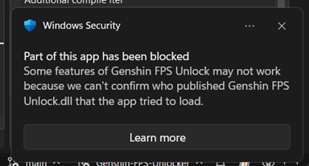

# Genshin Impact FPS Unlocker modified by Sefinek
> [Custom release for Genshin Stella Mod. Read more.](https://stella.sefinek.net)

Windows Security may show the following warning when you run the program:  
  
This is expected - the compiled exe and DLL aren't digitally signed (no certificate), so **Smart App Control** can't verify their publisher and blocks part of the app's functionality.

To fix this, disable the feature: `Windows Security` → `App & browser control` → `Smart App Control` → `Off`.

## Information
- This tool helps you to unlock the 60 FPS limit in the game.
- This is an external program which uses **WriteProcessMemory** to write the desired fps to the game.
- Handle protection bypass is already included.
- Does not require a driver for R/W access.
- Supports OS and CN version.
- Should work for future updates.
- You can download the compiled binary over at [Release](https://github.com/Genshin-Stella-Mod/Genshin-FPS-Unlocker/releases) if you don't want to compile it yourself.

## Usage
- Make sure you have the [.NET Desktop Runtime 10.0](https://dotnet.microsoft.com/en-us/download/dotnet/10.0). Usually it should come installed.
- Run the exe and click `Start game`.
- If it is your first time running, unlocker will attempt to find your game through the registry. If it fails, then it will ask you to either browse or run the game.
- Place the compiled exe anywhere you want (except for the game folder).
- Make sure your game is closed—the unlocker will automatically start the game for you.
- Run the exe as administrator, and leave the exe running.
> It requires administrator because the game needs to be started by the unlocker and the game requires such permission.

## Notes
- HoYoverse (miHoYo) is well aware of this tool, and you will not get banned for using FPS unlock.
- If you are using other third-party plugins, you are doing it at your own risk.
- Any artifacts from unlocking fps (e.g. stuttering) is NOT a bug of the unlocker.

## Compiling
Use `Visual Studio 2026 Community Edition` to compile.

## Credits
<a href="https://www.flaticon.com/free-icons/cat" title="cat icons">Cat icons created by Freepik - Flaticon</a>
